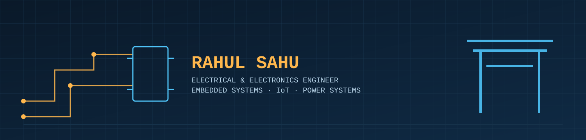
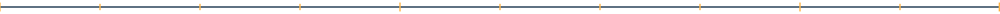

<!--
  README.md — RahulSahu1221/RahulSahu1221
  ─────────────────────────────────────────────
  Blueprint / engineering-datasheet theme. Built from scratch for this
  profile — banner and dividers are custom SVGs in /assets, not a
  third-party banner generator, so the visual identity isn't shared with
  anyone else's profile.

  Deliberately excludes programming-language badges (C, C++, Python, JS,
  HTML, CSS, Git) and any mention of coding/programming — Rahul's field is
  Electrical & Electronics Engineering, not Computer Science, and the
  profile should read that way. Only hardware/EEE tools he personally
  operates are listed.

  Toolchain badges are custom SVGs in /assets (real brand colors, one row
  per category, guaranteed single line — not shields.io badges).

  Activity/achievements come from metrics.svg, generated by
  .github/workflows/metrics.yml (self-hosted via GitHub Actions) instead
  of the public github-readme-stats/github-profile-trophy Vercel
  deployments, which have been getting paused/rate-limited and were
  showing as broken images.

  BEFORE PUBLISHING — replace every <<PLACEHOLDER>>:
    <<EMAIL>>          → your real email
    <<PORTFOLIO_URL>>   → delete the whole badge line below if you don't have one yet
    <<TWITTER_HANDLE>>  → delete the whole badge line below if you don't have one yet
-->

  
  <a href="mailto:<<sahurahulcoc@gmail.com>>"></a>
  <!-- delete this line if you don't have a portfolio yet -->
  <a href="<<PORTFOLIO_URL>>"></a>
 

## Profile

<table>
<tr><td>🎓</td><td><b>Role</b></td><td>Final-Year B.Tech EEE Student</td></tr>
<tr><td>🏫</td><td><b>Institution</b></td><td>Aditya College of Engineering &amp; Technology</td></tr>
<tr><td>📍</td><td><b>Location</b></td><td>Surampalem, Andhra Pradesh, India</td></tr>
<tr><td>⚙️</td><td><b>Focus</b></td><td>IoT · Embedded Systems · Power Systems</td></tr>
<tr><td>💼</td><td><b>Current</b></td><td>IoT Internship, Batch 6 — Emertxe</td></tr>
<tr><td>🏭</td><td><b>Past Training</b></td><td>OJT — Nepal Electricity Authority</td></tr>
<tr><td>🇯🇵</td><td><b>Language</b></td><td>Japanese — JLPT N5</td></tr>
<tr><td>🎯</td><td><b>Target</b></td><td>Engineering roles at Japanese firms</td></tr>
</table>

I work on hardware-first projects — circuit design, embedded control, and
sensor systems — taking an idea from a schematic through simulation to a
working prototype. My grounding is in electrical fundamentals and power
systems, and I'm building on that with embedded platforms and IoT
connectivity as I move toward roles with Japanese engineering firms.

## Toolchain

**Design & Simulation**

**Embedded Platforms**

**IoT & Cloud**

**Documentation & Version Control**

## Activity & Achievements

<!-- Generated by the GitHub Action in .github/workflows/metrics.yml —
     self-hosted, so it doesn't depend on a third party's live server. -->

## Featured Builds

| Project | What it does |
|---|---|
| **[EV-ADAS-System](https://github.com/RahulSahu1221/EV-ADAS-System)** | EV driver-assistance system on an STM32 Blue Pill — HC-SR04 ultrasonic sensors feed a real-time dashboard over UART. |
| **[Transformer-Life-Gauge](https://github.com/RahulSahu1221/Transformer-Life-Gauge)** | Estimates transformer insulation life using the IEEE C57.91 thermal aging model — a power-systems problem, solved with sensor data. |
| **[Smart-Factory-IoT-Monitoring-System](https://github.com/RahulSahu1221/Smart-Factory-IoT-Monitoring-System)** | Multi-node factory monitoring system built during the Emertxe IoT internship — sensor nodes report to a cloud dashboard. |
| **[solar-monitoring-system-arduino](https://github.com/RahulSahu1221/solar-monitoring-system-arduino)** | Tracks a solar panel's voltage, current, power, and energy output in real time using current and voltage sensing modules. |
| **[RONIN](https://github.com/RahulSahu1221/RONIN)** | JLPT N5–N4 vocabulary trainer with spaced repetition and offline support — built while studying for my own JLPT exams. |

## Contribution Snake

<!-- Generated by the GitHub Action in .github/workflows/snake.yml -->

**Open to internships, project collaborations, and roles with Japanese engineering firms.**

<a href="mailto:<<EMAIL>>"></a>

